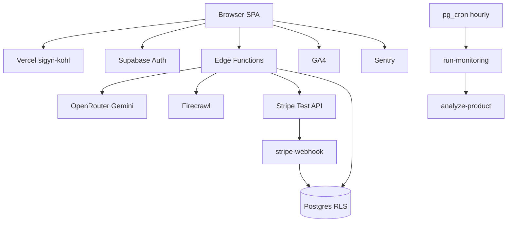

# InsightPM Production-Ready Launch — Design

**Date:** 2026-08-08  
**Status:** Draft for user review  
**Approach:** Sequential go-live (Approach 1)

## Decisions (approved)

| Topic | Choice |
|-------|--------|
| Package | Full launch package |
| Canonical URL | `https://sigyn-kohl.vercel.app` (custom domain deferred) |
| Stripe | Test mode only |
| Auth | Email/password + Google + GitHub OAuth |
| Observability | GA4 + Sentry |
| AI | OpenRouter (Gemini); Lovable fully removed |
| Execution order | Sequential gates |

## 1. Scope

### In scope

1. Commit and keep OpenRouter as the sole AI path; redeploy if needed.
2. Set required Supabase edge secrets (`OPENROUTER_API_KEY`, `FIRECRAWL_API_KEY`, Stripe test keys/prices/webhook, confirm `INTERNAL_FUNCTION_SECRET` + `SITE_URL`).
3. Create Stripe **test** products/prices matching Starter $29 / Growth $99 / Enterprise $499 monthly; webhook to `stripe-webhook`.
4. Configure Supabase Auth Site URL + redirect URLs for `sigyn-kohl.vercel.app`; enable Google and GitHub OAuth.
5. Set `app.settings.supabase_url` and `app.settings.service_role_key` so pg_cron can call `run-monitoring`.
6. Wire production Vercel env: `VITE_SUPABASE_*`, `VITE_GA_MEASUREMENT_ID`, `VITE_SENTRY_DSN`; remove leftover Sigyn/BusinessVoice secrets that confuse ops.
7. Align CORS/`SITE_URL` to `https://sigyn-kohl.vercel.app`; keep `insightpm.app` / `www` allowlisted for a later domain cutover.
8. Update `docs/LAUNCH.md` into a go-live runbook for this URL; get `npm run smoke`, `verify:launch`, and `verify:live` green (Stripe webhook check included).

### Out of scope

- DNS / custom domain for `insightpm.app`
- Stripe live keys
- New product features or UI redesign
- GraphQL discoverability advisor cleanup (optional follow-up)

## 2. Architecture



**Components**

| Unit | Responsibility | Interface |
|------|----------------|-----------|
| Vite SPA | UI, auth session, invoke browser-facing functions | Vercel static + env |
| `analyze-product` | Orchestrate scrape → classify → AI analysis | JWT or internal monitoring auth |
| `_shared/ai.ts` | OpenRouter chat completions + tool calling | `OPENROUTER_API_KEY` |
| Stripe functions | Checkout, portal, webhook entitlement writes | Stripe test secrets |
| pg_cron + `run-monitoring` | Hourly re-analysis for monitors | DB settings + service role |

## 3. Secrets & configuration

### Supabase edge secrets (required)

- `OPENROUTER_API_KEY`
- `FIRECRAWL_API_KEY`
- `INTERNAL_FUNCTION_SECRET` (already set)
- `SITE_URL=https://sigyn-kohl.vercel.app` (already set; reconfirm)
- `STRIPE_SECRET_KEY` (test)
- `STRIPE_WEBHOOK_SECRET`
- `STRIPE_PRICE_STARTER` / `GROWTH` / `ENTERPRISE`

Optional: `YOUTUBE_API_KEY`, `SCRAPECREATORS_API_KEY`.

**Sync path:** values go in gitignored `.env`, then `npm run secrets:sync` (never print values).

### Vercel production env

- Keep: `VITE_SUPABASE_URL`, `VITE_SUPABASE_PUBLISHABLE_KEY`, `VITE_SUPABASE_PROJECT_ID`
- Add: `VITE_GA_MEASUREMENT_ID`, `VITE_SENTRY_DSN`
- Remove leftover Sigyn/Retell/BusinessVoice keys from Production (and Prefer Preview if unused)

### Supabase Auth

- Site URL: `https://sigyn-kohl.vercel.app`
- Redirect URLs:  
  `https://sigyn-kohl.vercel.app/auth`  
  `https://sigyn-kohl.vercel.app/analyze`  
  `http://localhost:8080/auth` (dev)
- Providers: Email, Google, GitHub (OAuth client IDs/secrets from Google Cloud / GitHub Apps)

### Database cron settings

```sql
ALTER DATABASE postgres SET app.settings.supabase_url = 'https://zoxsygxolbzyhwezgnpg.supabase.co';
ALTER DATABASE postgres SET app.settings.service_role_key = '<service-role-key>';
```

## 4. Stripe test setup

1. Create three monthly recurring prices in Stripe **test** mode ($29 / $99 / $499).
2. Webhook endpoint:  
   `https://zoxsygxolbzyhwezgnpg.supabase.co/functions/v1/stripe-webhook`
3. Events: `checkout.session.completed`, `customer.subscription.created`, `customer.subscription.updated`, `customer.subscription.deleted`
4. Store `whsec_...` and price IDs as edge secrets.
5. Smoke with card `4242 4242 4242 4242`.

If prices already exist, reuse them; otherwise create via Stripe API using `STRIPE_SECRET_KEY`.

## 5. Observability

Frontend already supports:

- `src/lib/analytics.ts` → `VITE_GA_MEASUREMENT_ID`
- `src/lib/error-reporting.ts` → `VITE_SENTRY_DSN` (browser SDK via existing init path)

Implementation work is configuration + confirming init runs in production builds, not a new analytics stack. Privacy copy already mentions Sentry when configured.

## 6. Error handling & security

- Auth failures on internal functions return **401** (already deployed).
- OpenRouter 429/402 mapped to user-facing messages via `_shared/ai.ts`.
- Profiles remain non-user-writable for plan/subscription fields (RLS migration).
- No secrets in git; PAT used for deploy must be rotated after launch work.
- CORS allowlist includes production Vercel URL and future `insightpm.app`.

## 7. Verification & acceptance

Gates, in order:

1. `npm run smoke` (typecheck, tests, build)
2. Commit OpenRouter + secrets scripts + docs updates; push `main`
3. Secrets present on Supabase (`secrets list` names only)
4. `npm run verify:live -- https://sigyn-kohl.vercel.app` — all checks pass including Stripe webhook configured
5. Manual smoke from `docs/LAUNCH.md` §4 adapted to `sigyn-kohl.vercel.app`
6. Confirm GA network requests and a test Sentry event in dashboards
7. Confirm OAuth redirect completes for Google and GitHub
8. Confirm cron settings set (query `current_setting` or one successful `run-monitoring` invocation)

**Definition of done:** A new user can sign up (email or OAuth), complete Stripe **test** checkout, run an analysis powered by OpenRouter, see history, and errors/pageviews appear in Sentry/GA — all on `https://sigyn-kohl.vercel.app`.

## 8. Delivery sequence

1. Commit uncommitted OpenRouter migration and helper scripts  
2. User supplies keys in `.env` → sync to Supabase  
3. Create Stripe test prices + webhook (API or dashboard)  
4. Auth URLs + OAuth providers  
5. Cron DB settings via SQL  
6. Vercel env cleanup + GA/Sentry  
7. Update launch runbook for current URL  
8. Full verify + manual smoke  
9. Rotate Supabase PAT used in chat  

## 9. Dependencies on the operator

These cannot be invented by the agent and must be provided (via `.env` or dashboards):

- OpenRouter API key  
- Firecrawl API key  
- Stripe test secret key (or approval to create products with a provided key)  
- Google OAuth client ID/secret  
- GitHub OAuth client ID/secret  
- GA4 measurement ID  
- Sentry DSN  

Where the agent has CLI/API access and a key, it will create Stripe prices/webhook and push secrets without echoing values.
